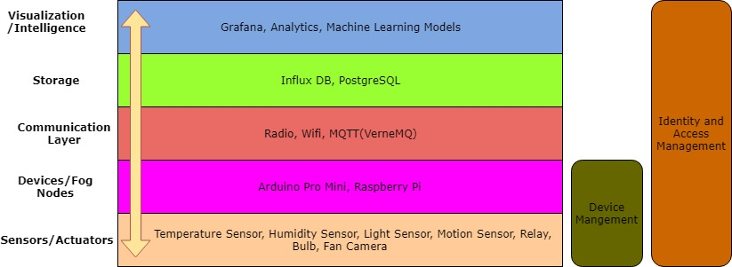
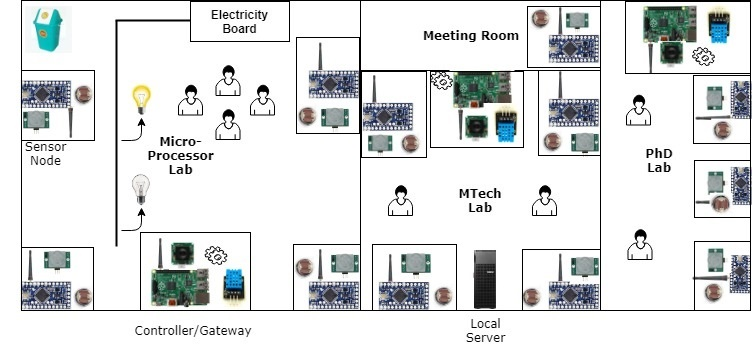

# SmartIoTLab

These are some program files that are being created and modified while working on creating a smart energy saving system for our IoT Lab.
As of now we have a motion sensor connected to ESP32 on which pubsub MQTT client library is added that sends the command to the 
Raspberry Pi based on the meeting of specific condition. Raspberry Pi acts as a controller/gateway in this scenario which is 
responsible for sending/receing command to/from different sensor nodes. One sensor node reads motion sensor data and then
checks to see if there has been any motion in last 5 minutes if there is no motion a command is sent to Controller also if there 
is a motion after switching off the light the command is sent to to the Controller to switch on the lights. There is another actuator
node based on ESP32 to which a 100 W lightbulb is connected to via a relay. It receives the command from the controller to swich or
switch off the light and accordingly it makes or breaks the circuit of the load using relay. The controller device also strore
the information about when the light was turned on or off in the influx db database.

## Objective
* To automatically monitor and control appliances based on human presence in the lab.
* Design power efficient sensor nodes for monitoring different parameters like temperature, humidity, light intensity and motion.
* Performing modeling and simulation of fog computing framework for Smart Lab automation system.
* Monitoring energy usage and designing strategy to reduce energy consumption.
* Developing Smart Dustbin and Smart Meeting Room systems
* Developing machine learning models to predict presence and energy consumption
* Employing data mining techniques to perform edge data analytics
* Exploring security paradigms for Smart Home

## Architecture

## Design

